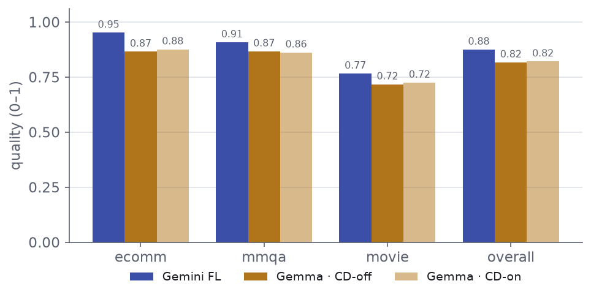
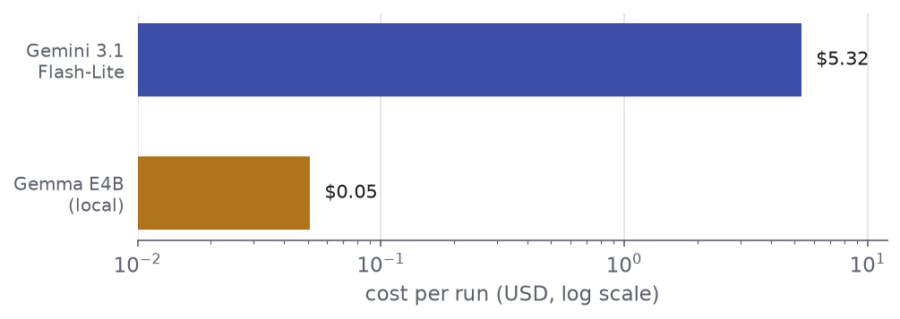
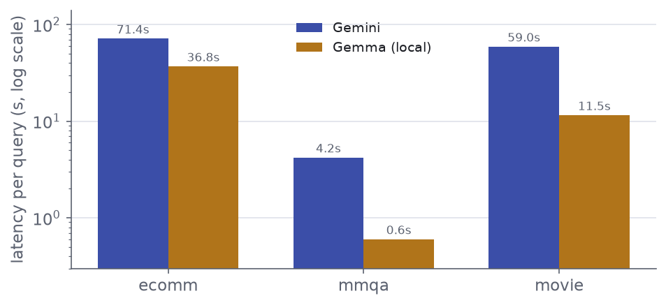
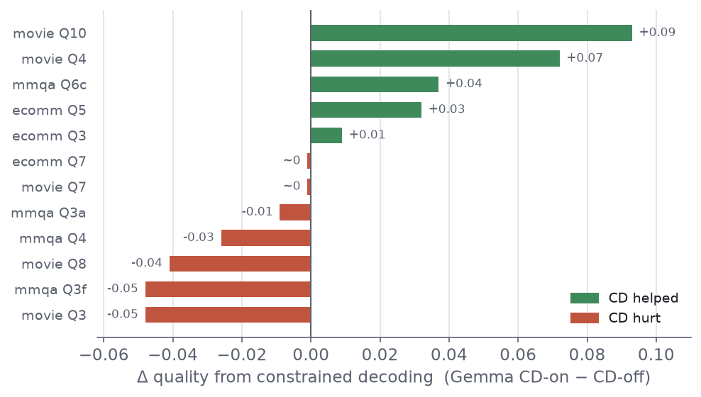

# Findings — cheap closed vs. local open, with the system held constant

A small model-isolation study on the **SemBench** benchmark: hold the LM-DB system
fixed at **BlendSQL** and vary **only the model** — a cheap closed API model
(**Gemini 3.1 Flash-Lite**) vs. a local open-weight model (**Gemma E4B**, FP8) —
to see how quality, latency, and cost move when nothing but the model changes.

- **Paper this builds on:** *"Large Databases Need Small, Open-Weight Language Models"*, Parker Glenn & Alfy Samuel — [arXiv:2606.31808](https://arxiv.org/abs/2606.31808).
- **What this fork changes vs. upstream:** [UPSTREAM.md](./UPSTREAM.md)
- **How to reproduce:** [EXPERIMENT_SETUP.md](./EXPERIMENT_SETUP.md) · methodology/risk notes: [CONSIDERATIONS.md](./CONSIDERATIONS.md)

> **Scope of this change.** This is a deliberately small, well-scoped extension of
> the upstream SemBench harness — not a new benchmark. It adds a Gemini backend, cost
> accounting, a decision rule, and run-resilience, then runs one clean head-to-head on
> the text subset. See *Limitations* for what it does **not** cover.

## TL;DR — a tradeoff, not a knockout

| Metric | Gemini 3.1 Flash-Lite | Gemma E4B (local) | Winner |
|---|---|---|---|
| **Quality** (overall, [0,1]) | **0.875** | 0.817 | Gemini — consistent, +0.058 |
| **Cost** / full run | $5.32 | **~$0.05** | Gemma — ~100–230× cheaper |
| **Latency** / query | 59 / 71 / 4.2 s | **12 / 37 / 0.6 s** | Gemma — 2–7× faster |

*(latency shown movie / ecomm / mmqa)*

With the system held constant, the cheap closed model is **~5% more accurate on
text**, while the local open model is **~100–230× cheaper and several× faster** —
and fully reproducible, with no rate limits. Which "wins" is a value judgment on
that tradeoff, not an open empirical question.

## Setup

BlendSQL v0.1.26 is held constant; only the model backend varies, so differences
are attributable to the model rather than the harness.

- **Models** — Gemini 3.1 Flash-Lite via the API (grammar-constrained decoding is
  unavailable on that path, so it runs CD-off); Gemma E4B
  (`prithivMLmods/gemma-4-E4B-it-FP8`) served locally with vLLM on an RTX 4090,
  run both **CD-off** and **CD-on**.
- **Matched settings** — both sides at `N_PARALLEL=16`, cascade-filter and
  early-exit **on**, so latency is like-for-like and only the model differs.
- **Scope** — 22 **text** queries (movie ×10, mmqa ×8, ecomm ×4). Image and audio
  queries are excluded: SemBench ships the databases but not the referenced
  image/audio binaries.
- **Runs & metrics** — 3 runs each; quality = F1 (retrieval) / normalized Spearman
  (ranking) / `1 − relative-error` (aggregation), all in [0,1]. Failed queries are
  scored 0 and logged, never silently dropped.
- **Cost** — Gemini: logged tokens × sync API price. Gemma: GPU-hours × rate
  ($0.69/hr on-demand 4090; ~$0.02/run at spot). Latency was validated
  **GPU-bound** (96% latency-weighted GPU utilization) via `gpu_check.py`.

## Results

**Quality, per scenario** — Gemini leads every scenario on every run.

| Scenario | Gemini FL | Gemma · CD-off | Gemma · CD-on |
|---|--:|--:|--:|
| ecomm | **0.952** | 0.866 | 0.876 |
| mmqa | **0.908** | 0.867 | 0.862 |
| movie | **0.766** | 0.717 | 0.725 |
| **Overall** | **0.875** | 0.817 | 0.821 |

*Gemini leads every scenario by a modest, consistent margin; the two Gemma bars (CD-off / CD-on) nearly overlap.*

*CD = **constrained decoding** — BlendSQL's grammar-level output constraint,
available only on the local (vLLM) side. The two Gemma columns barely differ; why
is unpacked in [Constrained decoding — the reframing](#constrained-decoding--the-reframing) below.*

**Cost & latency, per scenario** — the local model wins both, decisively.

| Scenario | Gemini $ | Gemma $ | Gemini s/q | Gemma s/q |
|---|--:|--:|--:|--:|
| ecomm | 3.05 | **0.03** | 71.4 | **36.8** |
| mmqa | 0.09 | **0.001** | 4.2 | **0.6** |
| movie | 2.19 | **0.02** | 59.0 | **11.5** |
| **Total / mean** | 5.32 | **0.05** | ~45 | **~16** |

*Cost per run (log scale): Gemini's token bill vs Gemma's GPU time — ~100–230× cheaper.*

*Latency per query by scenario (log scale): Gemma is faster in all three (2–7×).*

## Why this Gemini tier — the cheapest was already enough

This comparison deliberately uses Gemini's **cheapest** current tier, 3.1
Flash-Lite, to keep API spend down. The intent was to move up to a stronger,
pricier tier (Gemini 3 Flash) only if the cheap one struggled against Gemma. It
didn't — **Flash-Lite beat Gemma on every scenario, on all three runs** (mean gap
`−0.052`). Since even the floor of the closed lineup already out-scored the local
model on quality, a better — and more expensive — closed model would only *widen*
that lead, not change the finding, so we never ran one. The closed side's quality
edge here is a floor, not a ceiling; the open-vs-closed call comes down to cost,
latency, and reproducibility, not quality.

## Constrained decoding — the reframing

The headline compares both sides with constrained decoding **off** (fair, since
the Gemini API path can't use BlendSQL's grammar). BlendSQL *can* give local Gemma
that edge (CD-on). Reframed as each model is actually deployed — **Gemma with CD**
vs **Gemini without** — Gemma still trails overall (**0.821 vs 0.875**).

CD's overall effect on Gemma was **+0.003 — within run-to-run noise.** It reached
near-parity on the two format-sensitive queries (movie Q10 ranking: 0.72 vs 0.73;
ecomm Q5 clustering: 0.956 vs 0.964) and slightly hurt several aggregation queries,
roughly cancelling out.

*Turning CD on helps a few queries (ranking, clustering) and hurts a few (aggregation), netting +0.003 — within run-to-run noise.*

Why so small — and why it's a **scope effect, not a null result**: CD rescues a
small model only where the output format is rigid *and* the model catastrophically
fails it (the paper's big wins were 24-way classification, +0.35, and JSON
generation, +0.90). Our text queries are retrieval, ranking, and aggregation —
outputs the model rarely botches. Crucially, the two CD-decisive query types live
in the **audio and image** scenarios excluded here, so this study structurally
under-measures CD's value.

## Relation to the paper

The paper reports small open models *matching or beating* closed models on text;
this study finds the opposite on quality. The difference is expected and arguably
makes this the more model-isolated comparison: the paper compared Gemma against the
*other baseline systems* running Gemini (confounding system with model) and used the
older **Gemini 2.5 Flash**. Here the system is fixed at BlendSQL and only the model
changes, against the newer **3.1 Flash-Lite** tier.

## Limitations & further study

The text-only scope is honest but narrow, and it happens to exclude the query types
where the paper's central claim lives. Several follow-ups would sharpen the picture:

1. **Run the format-heavy queries.** ecomm's classification and JSON queries, and
   cars' 24-way classification (the queries that most punish a no-CD model), sit in
   the excluded image/audio scenarios. Testing them is the real test of whether
   Gemma's CD edge can overturn the quality gap. It requires sourcing the SemBench
   image binaries (Gemma's audio is a known weak spot).
2. **Make the CD comparison model-fair.** Gemini isn't truly format-blind: its API
   supports enum / JSON `responseSchema`, and the harness simply doesn't use it. A
   rigorous format-heavy test would grant Gemini its own structured output so any
   Gemma advantage isn't just a plumbing artifact.
3. **Scale up the open model, and its hardware.** The model was kept fixed at Gemma
   E4B to stay consistent with the original research, but E4B is the small,
   efficiency-oriented end of the Gemma family. The more valuable study sweeps larger
   open models (the 12B and 27B-class Gemma models, and comparable open releases) on
   correspondingly larger GPUs, and traces where quality first converges with, and
   eventually passes, the Gemini tiers, and at what price. The cheapest first step is
   Gemma 12B on the same 24 GB card at 4-bit (a config change and a re-run, marginal
   added cost); 27B needs a larger GPU (A100 40 GB or L40S 48 GB), a real step up in
   hourly rate. The expectation is that comparable quality is still reachable well
   below the API's cost today, but that this is a moving target: as newer and stronger
   closed models ship, the size of the open model needed to match them on quality, and
   therefore its cost, will keep climbing. Mapping that cost-versus-quality frontier,
   rather than a single point on it, is the interesting open question. The audio
   scenarios, where local models are weakest, belong in the same sweep.

## Reproduce

See [EXPERIMENT_SETUP.md](./EXPERIMENT_SETUP.md). The full per-query rollup is
written to `results/report.csv` by `sembench/compile_report.py` (results are
regenerated locally and git-ignored).

---

*Built on the SemBench harness from "Large Databases Need Small, Open-Weight
Language Models" (Glenn & Samuel, [arXiv:2606.31808](https://arxiv.org/abs/2606.31808)),
used under Apache-2.0. See [UPSTREAM.md](./UPSTREAM.md) for attribution and the full
change list.*
