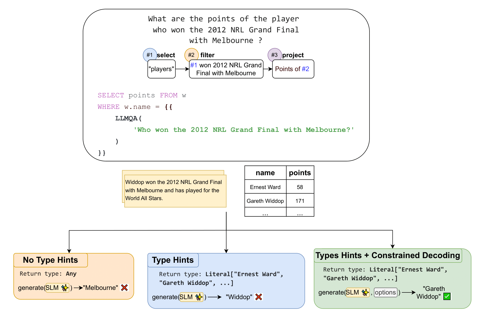

# play-by-the-type-rules

Experiment code for the paper [Play by the Type Rules: Inferring Constraints for LLM Functions in Declarative Programs](https://arxiv.org/abs/2509.20208). Query language implementation can be found in the [blendsql](https://github.com/parkervg/blendsql) library. 

## Setup 

The experiments were originally run with CUDA 12.4 and python 3.10. All models except for Llama-3.3-70B-Instruct are run on 4 24GB A10 GPUs. Llama-3.3-70B-Instruct was hosted with [vLLM](https://github.com/vllm-project/vllm) on 4 80GB A100 GPUs.

```
uv pip install -r requirements.txt
```

## Usage 

To run the core type ablation experiments:

```
./scripts/generate/baseline.sh

./scripts/execute/baseline.sh
```

To generate the end-to-end baselines:

```
./scripts/generate/e2e_baselines.sh
```

To generate programs using the context-free grammar (described Appendix A.1):

```
./scripts/generate/guided_grammar.sh
```




For the code used to perform the latency experiment described in Section 4.1, see https://github.com/parkervg/blendsql/tree/main/research. 

## Acknowledgements 

This experiment code was adapted from the [linc](https://github.com/benlipkin/linc) codebase. 


## Citation 

```
@article{glenn2025play,
  title={Play by the Type Rules: Inferring Constraints for LLM Functions in Declarative Programs},
  author={Glenn, Parker and Samuel, Alfy and Liu, Daben},
  journal={arXiv preprint arXiv:2509.20208},
  year={2025}
}
```