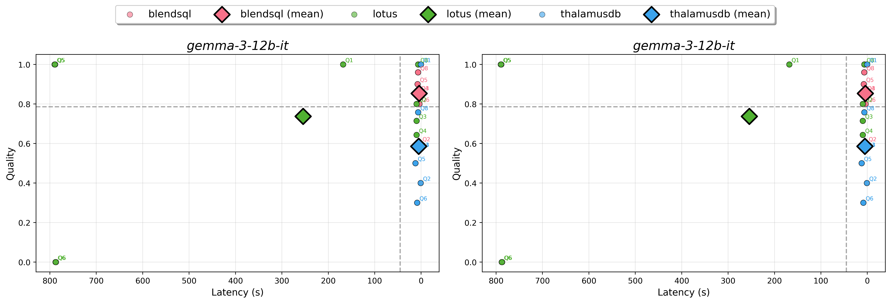

## Setup 

The experiments were originally run with CUDA 13.0 and python 3.12. All models were run on a single 16GB RTX 5080 with llama-cpp-python==0.3.16.

```
uv pip install -r requirements.txt
```

## Usage 

To run the core experiment:

```
./scripts/run_sembench.sh
```



## Acknowledgements 

This experiment code was adapted from the [SemBench](https://github.com/SemBench/SemBench) codebase. 


## Citation 

```
@article{glenn2025play,
  title={Play by the Type Rules: Inferring Constraints for LLM Functions in Declarative Programs},
  author={Glenn, Parker and Samuel, Alfy and Liu, Daben},
  journal={arXiv preprint arXiv:2509.20208},
  year={2025}
}
```